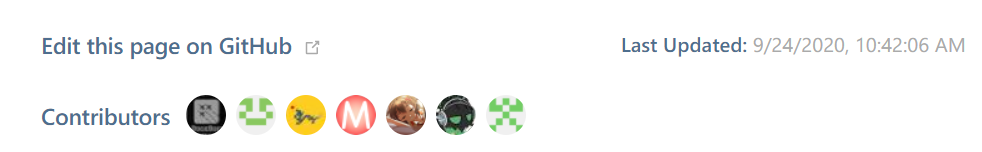

# [VuePress](https://vuepress.vuejs.org/) Contributors Plugin

This plugin provides a component for showing GitHub contributors. It uses [GitHub File Contributors](https://github.com/kidonng/github-file-contributors) under the hood.



## Usage

1. Install `@kidonng/vuepress-plugin-contributors`
2. Add the plugin to `.vuepress/config.js`

```js
module.exports = {
  plugins: [
    ['@kidonng/vuepress-plugin-contributors', {
      // Repository (default to `themeConfig.docsRepo || themeConfig.repo`)
      docsRepo: 'vuejs/vuepress',
      // Branch (defaults to `master`)
      docsBranch: 'master',
      // Document directory (defaults to `themeConfig.docsDir`)
      docsDir: 'docs',
      // Contributors label (defaults to `Contributors`)
      label: 'Authors'
    }]
  ],
  // i18n
  themeConfig: {
    locales: {
      '/': { contributorsLabel: 'Authors' },
      '/zh/': { contributorsLabel: '贡献者' }
    }
  }
}
```

3. Add `<Contributors />` component to your page
4. Profit 🎉

## Customizing

You can customize the component via `.contributors` class.
